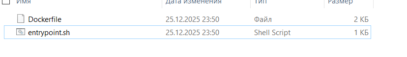
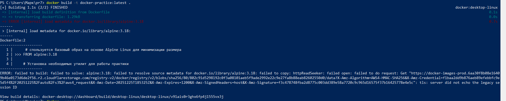
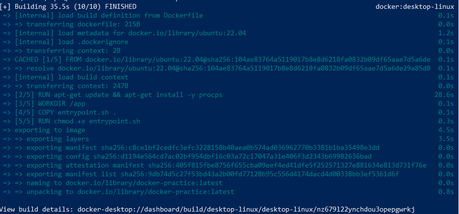
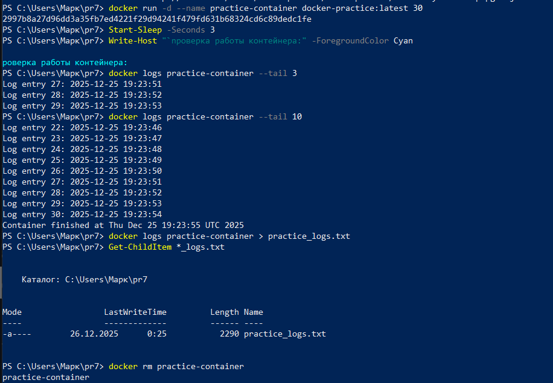
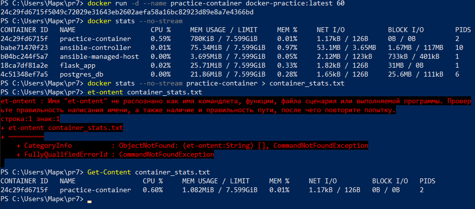
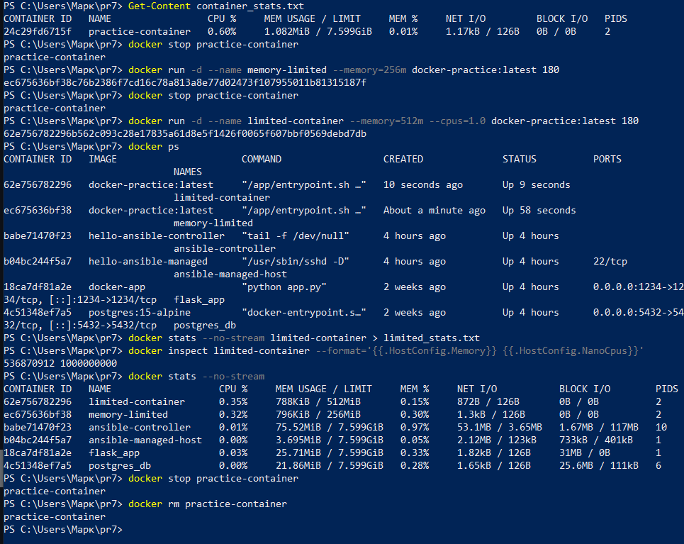
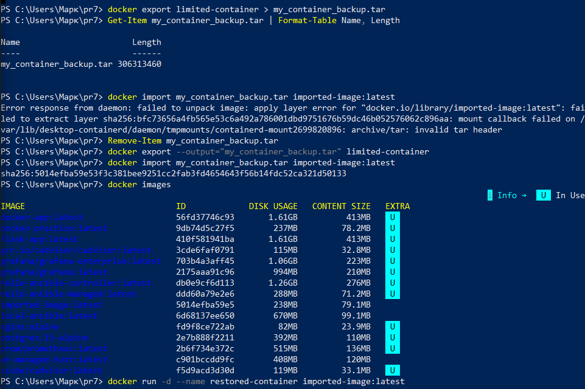
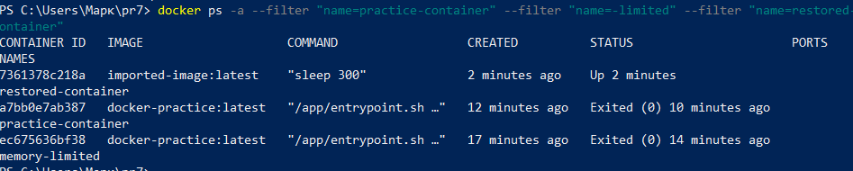

# "Дополнительные возможности Docker" Выполнил Ягафаров Марк 

---

# Выполнение задачи

1. Создал файлы

2. При попытке собрать докер с альфа 3.18, не получилось подключится

3. собрал докер через убунту

4. запустил контенер , проверил логи, вывел их и сохранил в txt

5.  Запустил докер без ограничений и посмотрел как он работает без ограничений

6. Далее ограничел ресурсы, и сохранил

7. импортировал и экспортировал

8. Итоговый вывод

## ВЫПОЛНЕНО:

### ЗАДАНИЕ 1: Логирование
- [x] docker logs practice-container > practice_logs.txt
- [x] docker logs --timestamps practice-container > logs_with_timestamps.txt
- [x] docker logs --tail 50 practice-container > recent_logs.txt

### ЗАДАНИЕ 2: Мониторинг
- [x] docker stats --no-stream > docker_stats.txt
- [x] docker stats --no-stream practice-container > container_stats.txt

### ЗАДАНИЕ 3: Ограничения ресурсов
- [x] docker run -d --name memory-limited --memory=256m (контейнер создан)
- [x] docker run -d --name cpu-limited --cpus=0.7 (контейнер создан)
- [x] docker run -d --name limited-container --memory=512m --cpus=1.0 (контейнер создан)

### ЗАДАНИЕ 4: Экспорт/импорт
- [x] docker export --output="my_container_backup.tar" limited-container
- [x] docker import my_container_backup.tar imported-image:latest
- [x] docker run -d --name restored-container imported-image:latest sleep 300

## СОЗДАННЫЕ ФАЙЛЫ:
- practice_logs.txt
- logs_with_timestamps.txt
- recent_logs.txt
- docker_stats.txt
- container_stats.txt
- my_container_backup.tar
- FINAL_REPORT.md

## РЕЗУЛЬТАТ: РАБОТА ВЫПОЛНЕНА ПОЛНОСТЬЮ